# Alya VPN 🛡️

[](https://github.com/alya-lang/alya)
[](LICENSE)
[](#security--cryptography)
[](#split-tunneling-engine)

High-performance, secure, per-application split-tunneling VPN client & server built for the [Alya Programming Language](https://github.com/alya-lang/alya).

---

## 🌟 Highlights

- **Per-Application Split-Tunneling:** Route only specific applications (e.g. Discord, Steam) through the encrypted VPN tunnel, or exclude specific applications while tunneling everything else.
- **Zero External Runtime Dependencies:** Cryptographic operations (ChaCha20-Poly1305 AEAD + SHA-256 KDF) and OS kernel process lookup are compiled directly into the binary via Alya's native `[build]` directive.
- **Client-Server Architecture:** Run the headless VPN server on any remote Linux VPS or cloud instance, and connect seamlessly from local clients (Windows, macOS, Linux).
- **Local SOCKS5 Proxy:** Client provides a standard local SOCKS5 proxy (`127.0.0.1:1080`). Any application, browser, or OS-level proxy settings can route through it.
- **Dynamic Process Inspection:** Resolves incoming local TCP connections to the originating executable name in real time (via `GetExtendedTcpTable` on Windows and `/proc/net/tcp` on Linux).
- **Hardened Wire Framing:** Custom binary-safe envelope protocol (`AV01`) featuring CSPRNG-generated nonces, Poly1305 message authentication codes (MAC), and tamper rejection.

---

## 📐 Architecture Overview

```mermaid
flowchart LR
    subgraph Client ["Client Machine (Local)"]
        direction TB
        AppDiscord["Discord.exe / Games"] -->|SOCKS5 Port| LocalProxy["Alya SOCKS5 Proxy\n(127.0.0.1:1080)"]
        AppBrowser["Browser / Other Apps"] -->|SOCKS5 Port| LocalProxy
        LocalProxy --> Resolver["OS Process Resolver\n(Port -> PID -> Process)"]
        Resolver --> Router{"Split Tunnel Router\n(include / exclude)"}
        Router -->|VPN Match| Encryptor["ChaCha20-Poly1305 AEAD\nFrame Pack & Encrypt"]
        Router -->|Bypass Match| DirectRelay["Direct Local Bypass\n(Local WAN)"]
    end

    DirectRelay -->|Plain Traffic| InternetDirect["Direct Internet"]

    subgraph Tunnel ["Encrypted Transport Tunnel"]
        Encryptor -->|TCP Envelope AV01| NetWire["Public Network / Internet"]
    end

    subgraph Server ["VPN Remote Server (VPS)"]
        direction TB
        NetWire --> ServerEngine["Alya VPN Server Daemon\n(0.0.0.0:51822)"]
        ServerEngine --> Decryptor["AEAD Decrypt &\nPoly1305 MAC Verification"]
        Decryptor --> Forwarder["Remote Target Forwarder"]
        Forwarder --> TargetDest["Discord Gateway / Web Endpoints"]
    end
```



---

## 🚀 Split-Tunneling Modes

Alya VPN supports 3 intelligent routing modes configured in `config/client.toml`:

### 1. `include` (Whitelist Mode)
Only explicitly listed applications will be tunneled through the remote VPN server. All other applications connect directly to the internet through your local connection.

```toml
[split_tunnel]
mode = "include"
apps = ["Discord.exe", "discord", "steam*"]
```
*Example:* Only Discord voice & gateway traffic uses the VPN to bypass local ISP blocks, while browsers and downloads utilize full unthrottled local bandwidth.

### 2. `exclude` (Blacklist Mode)
All system applications are routed through the VPN tunnel **except** the explicitly specified applications.

```toml
[split_tunnel]
mode = "exclude"
apps = ["Discord.exe", "qBittorrent.exe"]
```
*Example:* All internet traffic goes through the secure VPN server, but Discord and torrent clients bypass the tunnel to maintain low gaming latency or avoid VPS transfer limits.

### 3. `all` (Full Tunnel Mode)
Every connection routed through the SOCKS5 proxy is encrypted and forwarded through the VPN server.

```toml
[split_tunnel]
mode = "all"
apps = []
```

---

## 🔒 Security & Cryptography

Alya VPN employs modern, misuse-resistant cryptographic primitives bundled as native C implementations:

| Primitive | Standard | Purpose |
|---|---|---|
| **ChaCha20** | RFC 8439 | 256-bit high-speed stream cipher with high resistance to side-channel attacks |
| **Poly1305** | RFC 8439 | 128-bit cryptographic message authenticator (one-time MAC per frame) |
| **SHA-256** | FIPS 180-4 | Cryptographic Key Derivation Function (KDF) from the shared secret passphrase |
| **CSPRNG** | Native OS | Secure 96-bit (12-byte) unique nonces generated per frame |

### Frame Wire Format

Each transmitted frame is framed with the `AV01` envelope:

```text
+----------+---------+------------+-------------+--------------+------------------+
| Magic    | Version | Type (hex) | Nonce (hex) | Tag (hex)    | Ciphertext (hex) |
| "AV" (2) | "01"(2) | 2 bytes    | 24 bytes    | 32 bytes     | 2 * N bytes      |
+----------+---------+------------+-------------+--------------+------------------+
```
Any frame with an invalid Poly1305 MAC tag or invalid header is immediately dropped by both the client and server without leaking plaintext data.

---

## 💻 Quick Start & Usage

### Prerequisites
- [Alya Compiler](https://github.com/alya-lang/alya) `v0.0.17` or later installed.
- C compiler (`gcc` or `clang`) for native C compilation via `[build]` directive.

### 1. Run the VPN Server (on VPS)

#### Option A: Using Docker & Docker Compose (Recommended)

Run the headless server instantly in a lightweight container:

```bash
# Clone and start with Docker Compose
docker compose up -d --build
```
To view logs:
```bash
docker compose logs -f
```

#### Option B: Using Alya CLI directly

```bash
alya run src/main.alya -- server
```
*Options:*
- `--port <number>`: Override bind port (default: `51822`).
- `--key <passphrase>`: Specify authentication passphrase.

### 2. Run the Client (on local machine)

```bash
alya run src/main.alya -- client
```
*Options:*
- `--server <host:port>`: VPN server endpoint (default: `127.0.0.1:51822`).
- `--local-port <port>`: Local SOCKS5 listen port (default: `1080`).
- `--mode <all|include|exclude>`: Split tunneling mode.
- `--protocol <tcp|udp|both>`: Forwarded payload types (default: `both`). UDP is carried as UDP-over-TCP datagrams; the SOCKS5 UDP relay listens on `proxy_port + 1`.
- `--apps <app1,app2,...>`: Comma-separated application filters.

### 3. Configure Applications (e.g. Discord)

To route Discord through Alya VPN:
1. Start the client first, then open Discord **afterwards** so it picks up proxy/DNS settings.
2. Either rely on the automatic system proxy, or force Discord (macOS):
   `/Applications/Discord.app/Contents/MacOS/Discord --proxy-server='socks5://127.0.0.1:1080'`
   (`socks5://` resolves hostnames through the tunnel, which is what the domain rules need).
3. In `config/client.toml`, keep `mode = "include"` with `apps = ["Discord", "ShipIt", "curl"]` and the Discord `domains` list.
4. Text/API/gateway traffic is detected, matched, encrypted with ChaCha20-Poly1305, and forwarded through your remote VPS. Voice (UDP) needs an app that uses SOCKS5 UDP ASSOCIATE; raw Discord voice UDP bypasses any SOCKS proxy.

### macOS notes
- The Alya runtime on ARM64 Macs can crash (`bus error`) while parsing the
  documented `config/client.toml`. Use the lean `config/client.mac.toml`
  instead (same values, no comment lines, short lines):
  `cp config/client.mac.toml config/client.local.toml`, set `server_host`
  to the real VPS IP there (never commit the real IP), then
  `./alya-vpn client --config config/client.local.toml`.
- If the client still refuses file configs, pass everything via CLI flags
  (`--server`, `--port`, `--mode`, `--protocol`, `--apps`, `--domains`).
- Restart Discord AFTER starting the client so it picks up proxy/DNS.

### General use (browsers & other apps)

This VPN is a SOCKS5 proxy, not a TUN device — anything that can point at
a proxy works, raw UDP/ICMP/ping from proxy-unaware apps does not enter it:
- Any app: SOCKS5 `127.0.0.1:1080`, or HTTP proxy URL `http://127.0.0.1:1080`
  (HTTP CONNECT is answered on the same port).
- Firefox: `socks host 127.0.0.1:1080` (SOCKS v5) + `network.proxy.socks_remote_dns = true`
  so hostnames resolve through the tunnel instead of local DNS.
- Chrome/Edge: `--proxy-server='socks5://127.0.0.1:1080'`, or the automatic
  system proxy. For full tunneling disable QUIC (`chrome://flags` →
  `#enable-quic` → Disabled), otherwise UDP/443 bypasses the proxy.
- curl: `curl -x socks5h://127.0.0.1:1080 <url>` (`socks5h` = remote DNS).
- Prefer DNS-over-HTTPS in browsers; OS-level UDP/53 never enters SOCKS.
- Dual-stack: the proxy, the UDP relay and the server all listen on IPv4
  and IPv6 (`127.0.0.1` + `[::1]` by default), and forwarding targets may
  be either family (IPv4 preferred). Apps using `localhost`/`::1` work.
  (Cosmetic: IPv6 SOCKS peers show as `[unknown:port]` because the Alya
  runtime does not report v6 peer ports yet; routing by host rules is
  unaffected.)

---

## 🛠️ CLI Reference

```text
Commands:
  server          Starts the remote Alya VPN server daemon
  client          Starts the local SOCKS5 proxy and split-tunneling client
  check-port      Inspects a local port and prints the owning process name
  benchmark       Executes ChaCha20-Poly1305 encryption/decryption benchmarks

Global Options:
  --config <path> Path to configuration TOML file
  --key <secret>  Pre-shared encryption passphrase
  --help          Display help and usage guidelines
```

---

## 🧪 Running Tests

Alya VPN includes an automated test suite covering cryptography, wire framing, split-tunneling routing, and end-to-end integration:

```bash
# 1. Cryptography verification (ChaCha20-Poly1305 AEAD roundtrip & tamper detection)
alya run tests/test_crypto.alya

# 2. Wire framing & packet serialization
alya run tests/test_protocol.alya

# 3. Split-tunneling rules & wildcard matching
alya run tests/test_rules.alya

# 4. End-to-End simulation (handshake -> connect -> duplex stream -> teardown)
alya run tests/test_e2e.alya

# 5. Throughput benchmark
alya run src/main.alya -- benchmark
```

---

## 📁 Repository Structure

```text
App/vpn/
├── alya.toml               # Package manifest with [build] C directive
├── .gitignore              # Ignored build artifacts & temp files
├── README.md               # Project documentation
├── c/                      # Native C acceleration engine
│   ├── crypto.h            # ChaCha20-Poly1305 & SHA-256 declarations
│   ├── crypto.c            # Embedded C cryptography implementation
│   ├── proc_resolver.h     # Native OS socket-to-process lookup header
│   └── proc_resolver.c     # Win32 & Linux process inspection
├── config/                 # Sample configuration files
│   ├── client.toml         # Client split-tunneling & proxy settings
│   └── server.toml         # Server listen & authentication settings
├── src/
│   ├── main.alya           # CLI entry point and argument dispatcher
│   ├── ffi.alya            # Low-level extern C function declarations
│   ├── common/
│   │   ├── crypto.alya     # High-level Alya cryptographic API
│   │   └── protocol.alya   # AV01 framing, packet serializer & parser
│   ├── client/
│   │   ├── resolver.alya   # Process inspection wrapper
│   │   ├── router.alya     # Whitelist / Blacklist pattern matcher
│   │   └── local_proxy.alya# SOCKS5 server & traffic relay
│   └── server/
│       └── forwarder.alya  # Multi-client TCP decrypt & target relay
└── tests/
    ├── test_crypto.alya    # Crypto unit tests
    ├── test_protocol.alya  # Protocol serialization tests
    ├── test_rules.alya     # Split-tunneling pattern tests
    └── test_e2e.alya       # Full end-to-end simulation tests
```

---

## 📄 License

This project is licensed under the **MIT License**.
See the [LICENSE](LICENSE) file for details.
